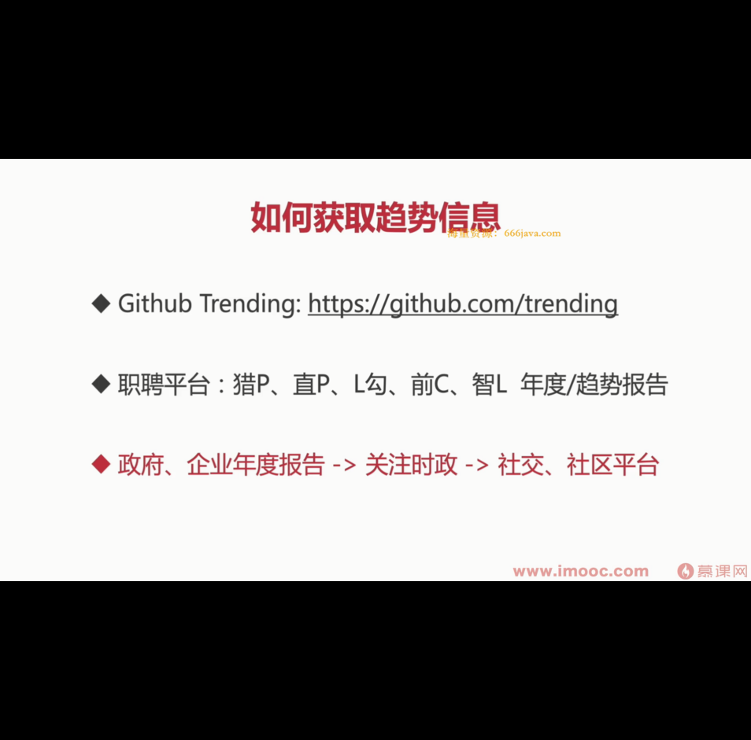
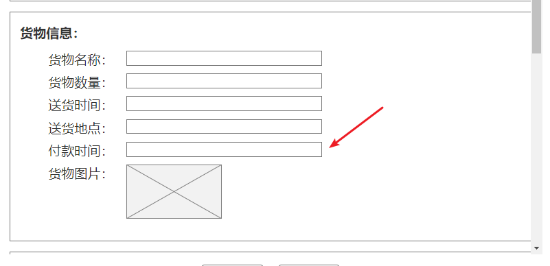

今天安装了一个思维导图软件，电脑开始闪屏和蓝屏了。

重装系统失败，官网下载和驱动精灵都尝试过了还是不行。

最后还是要重装系统，重装系统能解决百分之九十九问题，但是可惜了我之前安装的环境了。

经验告诉我，不要等着做事情，时间是自己的，不抓住就会流逝，多想办法多学东西，多干活。

还有一个要点就是多输出，逼着自己输出文档，输出代码！！


大前端2022课程

学习到第一阶段第一部分第二章节 前端成长困境破局

学到最重要一点是怎么去建立自己知识体系，要通过什么手段去获取有用的信息来调整自己的方向




---

eslint配置

配置常用规则

```js
module.exports = {
  root: true,
  env: {
    node: true
  },
  extends: ['plugin:vue/vue3-essential', '@vue/eslint-config-standard'],
  rules: {
    'no-console': process.env.NODE_ENV === 'production' ? 'warn' : 'off',
    'no-debugger': process.env.NODE_ENV === 'production' ? 'warn' : 'off',
    'space-before-function-paren': 'off',
    'vue/multi-word-component-names': 'off',
    indent: 'off',
    'prefer-regex-literals': 'off',
    fix: 'off',
    eqeqeq: ['off'], // 去除全等限制
    semi: 0, // 去除分号限制
    'comma-dangle': ['error', 'only-multiline'], // 运行多行的时候后面没东西也可以写逗号 逗号悬挂限制
  }
}
```


`https://eslint.org/docs/latest/rules/comma-dangle#rule-details`

`yarn add -D prettier@^2.5.1 eslint@^8.7.0 vue-eslint-parser@^8.0.0`


---

今天电脑故障，最后还是没有安装好，打算有空的时候可以去重装一下系统

今天把新增货单页面框架样式实现了


---



付款时间这里好像没有对应字段
