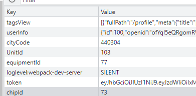

今天开始按照半小时工作制度来干活

现在,除了吃饭的钱,喝牛奶的钱,其他的钱都存下来,不要去用,因为这些钱以后要用到,没钱的感受真的很难受!!!


6:00-6:30 起床回公司

6:30:7:30 打篮球回公司

7:30-8:45 看短视频,赌博的危害,小赌怡情大赌伤身(借口),茶馆(小赌->中赌->大赌->赌博/六合彩->网络赌博)

黑社会是存在的,并且通过垄断某一正当生活必须行业,暴力催收来做到营收盈利的,上贡也是为了官商勾结,拿到权力,最后的目标还是为了盈利

AI怎么去赚,还是跟掘金者和配套工具提供者(卖水,卖牛仔裤)的问题, 所以大家都卖ai课程,卖工具,都贩卖焦虑(失业的焦虑),作为普通人,以后有空去看看自己行业最新的消息(翻墙),有遇到类似的情况,最快速度卖一波,赚这个快钱就走,最好就是卖账号

椰子变质,有异味最好就丢掉,不要吃,吃了去医院看病的钱很贵,特别是深圳没有医保,自己还受罪


8:45-9:00 写总结和今天要做的事情

1.采集单元详情页面

2.采集单元编辑弹窗

3.采集单元列表 对接 跟后端确认一下 查询采集器列表接口没做好

4.vue表单校验

5.vue后台管理上传图片并实现图片裁剪

6.warning


工作之外:

1.看篮球练习视频(找到教学视频)

2.看慕课网大前端视频(做思维导图)

3.做项目总结,把常用的组件做个总结(持续集成)


9:00-9:30

看接口文档


9:30-10:00

1.修复table显示8条数据错误,跟后端沟通一下接口出错问题


10:00-11:38

1.确认需求,开始写编辑采集器单元弹框


11:38-12:30


collectorDetail?id=73&cityCode=440304

collectorUnitDetail?id=103




总结休息

---

12:45-2:00

吃饭,休息

---

2:00-2:30

1.

2:30-3:00

1.

3:00-3:30


---

3:30-3:45


---

3:45-4:15

1.

4:15-4:45

1.

4:45-5:15


---

5:15-5:30


---

5:30-6:00


6:00-6:30


6:30-7:00


---

7:00-7:30

break和总结


持续运动时间,目标:30分钟

---

设备列表页面

**置顶 与 取消置顶** 

---

采集器详情

编辑采集器单元样式 细节调整

---

总体:

1.png图片不要白底

2.去除多余的侧边菜单项

3.去除多余的顶部菜单栏


**表单样式提交的时候需要进行校验**


---


```
const toCollectUnit = (item) => {
  console.log('item', item.id);
  setItem('UnitId', item.id);
  router.push({
    path: '/equipment/collectorUnitDetail',
    query: { id: item.id }
  });
};
```

