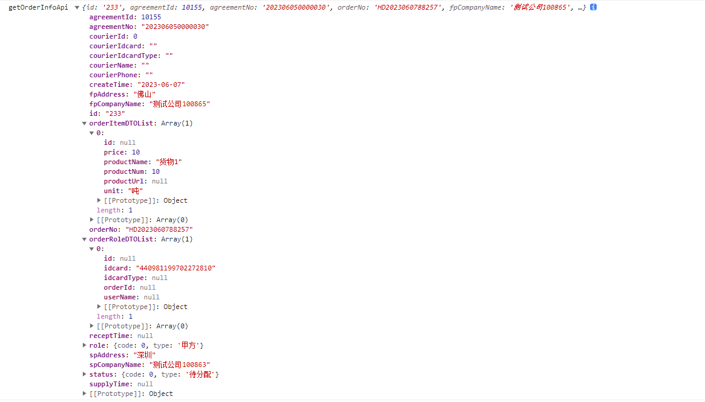

今天开始按照半小时工作制度来干活

现在,除了吃饭的钱,喝牛奶的钱,其他的钱都存下来,不要去用,因为这些钱以后要用到,没钱的感受真的很难受!!!

今天要做的事情:

1.vue表单校验

2.vue后台管理上传图片并实现图片裁剪

3.warning

4.调整样式


工作之外:

1.看篮球练习视频(找到教学视频)

2.看慕课网大前端视频(做思维导图)

3.做项目总结,把常用的组件做个总结(持续集成)

4.尚硅谷前端html+css零基础教程，2023最新前端html5+css3视频 https://www.bilibili.com/video/BV1p84y1P7Z5/?p=3&spm_id_from=pageDriver&vd_source=e0e11e05c0302f9fe28f9eb83f05e764


6:30 起床

7:00 回公司

7:10-10:00 回溯代码


10:00-11:30 看echarts图实现


总结休息

---

12:45-2:00

吃饭,休息

---

2:00-2:30

1.

2:30-3:00

1.

3:00-3:30


---

3:30-3:45


---

3:45-4:15

1.

4:15-4:45

1.

4:45-5:15


---

5:15-5:30


---

5:30-6:00


6:00-6:30


6:30-7:00


---

7:00-7:30

break和总结


持续运动时间,目标:30分钟

---

设备列表页面

**置顶 与 取消置顶** 

---

采集器详情

编辑采集器单元样式 细节调整

---

总体:

1.png图片不要白底

2.去除多余的侧边菜单项

3.去除多余的顶部菜单栏


**表单样式提交的时候需要进行校验**


---


```
const toCollectUnit = (item) => {
  console.log('item', item.id);
  setItem('UnitId', item.id);
  router.push({
    path: '/equipment/collectorUnitDetail',
    query: { id: item.id }
  });
};
```


---

1.送货员管理

获取货单详情接口有问题  /prod-api/api/order/{id}



提交接口 /prod-api/api/order/{id} 修改货单信息，货单状态的转变


```
"
### Error updating database.  Cause: java.sql.SQLSyntaxErrorException: You have an error in your SQL syntax; check the manual that corresponds to your MySQL server version for the right syntax to use near 'where id = null' at line 3
### The error may exist in URL [jar:file:/jar/ruoyi-admin.jar!/BOOT-INF/lib/ruoyi-biz-3.8.2.jar!/mapper/biz/OrderMapper.xml]
### The error may involve com.ruoyi.biz.mapper.OrderMapper.updateOrder-Inline
### The error occurred while setting parameters
### SQL: update biz_order                    where id = ?
### Cause: java.sql.SQLSyntaxErrorException: You have an error in your SQL syntax; check the manual that corresponds to your MySQL server version for the right syntax to use near 'where id = null' at line 3
; bad SQL grammar []; nested exception is java.sql.SQLSyntaxErrorException: You have an error in your SQL syntax; check the manual that corresponds to your MySQL server version for the right syntax to use near 'where id = null' at line 3"
```


2.取消货单,接口有问题

 /prod-api/api/order/{id} 修改货单信息，货单状态的转变

没报错但是 修改不了

233  {status: 1}


3.新增货单要加限制(身份证号,手机号这些)


202306050000030


货物1

吨


货物2


2023-06-09

深圳

佛山


黄培荣

440981199702272810

13430348404


```json
{"agreementId":10155,"billTime":"2023-06-08","courierId":0,"courierIdcard":"","courierIdcardType":"","courierName":"","courierPhone":"","fpAddress":"佛山","fpCompanyName":"测试公司100865","orderDTOList":[{"idcard":"440981199702272810","idcardType":"大陆居民身份证","userName":"黄培荣"}],"orderItemDTOList":[{"price":10,"productName":"货物1","productNum":10,"productUrl":"/profile/upload/2023/06/07/微信图片_20220721162125_20230607165741A013.png","unit":"吨"},{"price":10,"productName":"货物2","productNum":10,"productUrl":"/profile/upload/2023/06/07/微信图片_20220721162121_20230607165744A014.jpg","unit":"吨"}],"spAddress":"深圳","spCompanyName":"测试公司100863"}


{"agreementId":10155,"billTime":"2023-06-08","courierId":0,"courierIdcard":"","courierIdcardType":"","courierName":"","courierPhone":"","fpAddress":"佛山","fpCompanyName":"测试公司100865","orderRoleDTOList":[{"idcard":"440981199702272810","idcardType":"大陆居民身份证","userName":"黄培荣"}],"orderItemDTOList":[{"price":10,"productName":"货物1","productNum":10,"productUrl":"/profile/upload/2023/06/07/微信图片_20220721162125_20230607214244A010.png","unit":"吨"}],"spAddress":"深圳深圳","spCompanyName":"测试公司100863"}
```

HD2023060788257
